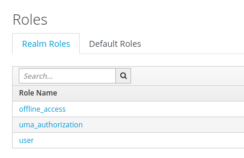

## SpringBoot Demo using Openid-Connect

`frontend` - uses oauth/openid-connect - public access type, requires user login
`backend` - uses oauth bearer token (JWT)

### Deploying to OpenShift

Setup SSO if required:
```
oc apply -n openshift -f https://raw.githubusercontent.com/jboss-openshift/application-templates/ose-v1.3.7/jboss-image-streams.json
oc new-project rh-sso --display-name='SSO' --description='SSO'
oc create -f https://raw.githubusercontent.com/jboss-openshift/application-templates/master/secrets/sso-app-secret.json -n rh-sso
oc create sa sso-service-account
oc policy add-role-to-user edit system:serviceaccount:$(oc project -q):sso-service-account
oc new-app sso71-mysql-persistent -p HTTPS_NAME=jboss -p HTTPS_PASSWORD=mykeystorepass -p SSO_ADMIN_USERNAME=ssoUser -p SSO_ADMIN_PASSWORD=ssoPassword
```

Login to SSO and Create a new Realm - import the file in this repo: 
```
./springbootssodemo-realm.json
```

Deploy applications:
```
git clone git@github.com:eformat/spring-boot-keycloak-bearer
oc new-project bearersso --display-name='SpringBootDemo Bearer SSO' --description='SpringBootDemo Bearer SSO'
oc policy add-role-to-user view --serviceaccount=default -n $(oc project -q)
cd ~/git/spring-boot-keycloak-bearer/backend
mvn clean fabric8:deploy
-- (Optional for testing)
oc expose svc backend

cd ~/git/spring-boot-keycloak-bearer/frontend
mvn clean fabric8:deploy
oc expose svc frontend
```

Test:
```
Browse to http://frontend-bearersso.192.168.136.2.nip.io/
Select 'My products' link
login: testuser / password
logout

Browsing directly to service endpoint will give 401 unless logged in: 
http://backend-bearersso.192.168.136.2.nip.io/protected
```

### The fiddly bits

fronted Client in SSO - you must set `Web Origins` for cors() to work


backend Client is standard bearer token:


user role mapping - the `user` role is specified at the realm level, so `DO NOT SET` this to true in `application.properties`! (default is false)
```
#keycloak.use-resource-role-mappings=true

```



In the Client Rest call from frontend -> backend, make sure to use and configure `KeycloakRestTemplate`

Documentation: https://github.com/keycloak/keycloak-documentation/blob/master/securing_apps/topics/oidc/java/spring-security-adapter.adoc


### Testing Bearer Token from CLI

```
KC_REALM=SpringBootSSODemo
KC_USERNAME=testuser
KC_PASSWORD=password
KC_CLIENT=frontend
#KC_CLIENT_SECRET=50227c10-42c5-40b7-bc40-e0d83567031d
#         -d "client_secret=$KC_CLIENT_SECRET" \
KC_URL=http://sso-rh-sso.192.168.136.2.nip.io/auth

# Request Tokens for credentials
KC_RESPONSE=$( \
   curl -k -v \
        -d "username=$KC_USERNAME" \
        -d "password=$KC_PASSWORD" \
        -d 'grant_type=password' \
        -d "client_id=$KC_CLIENT" \
        "$KC_URL/realms/$KC_REALM/protocol/openid-connect/token" \
    | jq .
)

KC_ACCESS_TOKEN=$(echo $KC_RESPONSE| jq -r .access_token)
KC_ID_TOKEN=$(echo $KC_RESPONSE| jq -r .id_token)
KC_REFRESH_TOKEN=$(echo $KC_RESPONSE| jq -r .refresh_token)

curl -H "Authorization: Bearer $KC_ACCESS_TOKEN" \
http://backend-bearersso.192.168.136.2.nip.io/protected
```

### Export Previously configured SSO Config
```
oc scale --replicas=1 dc sso
oc env dc/sso -e "JAVA_OPTS_APPEND=-Dkeycloak.migration.action=export -Dkeycloak.migration.provider=singleFile -Dkeycloak.migration.realmName=SpringBootSSODemo -Dkeycloak.migration.usersExportStrategy=REALM_FILE -Dkeycloak.migration.file=/tmp/springbootssodemo-realm.json"
oc scale --replicas=1 dc sso
oc rsync sso-3-rnnlw:/tmp/springbootssodemo-realm.json .
```
